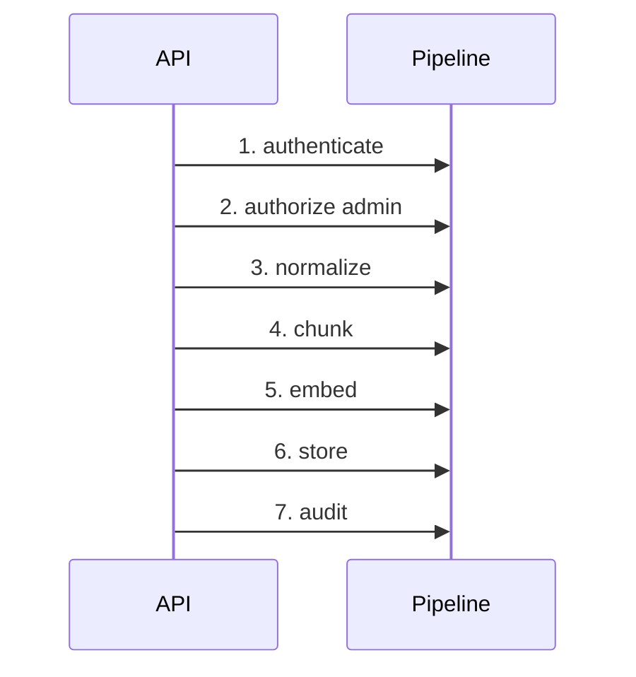
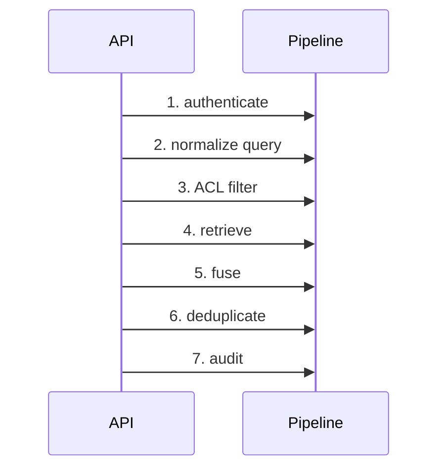
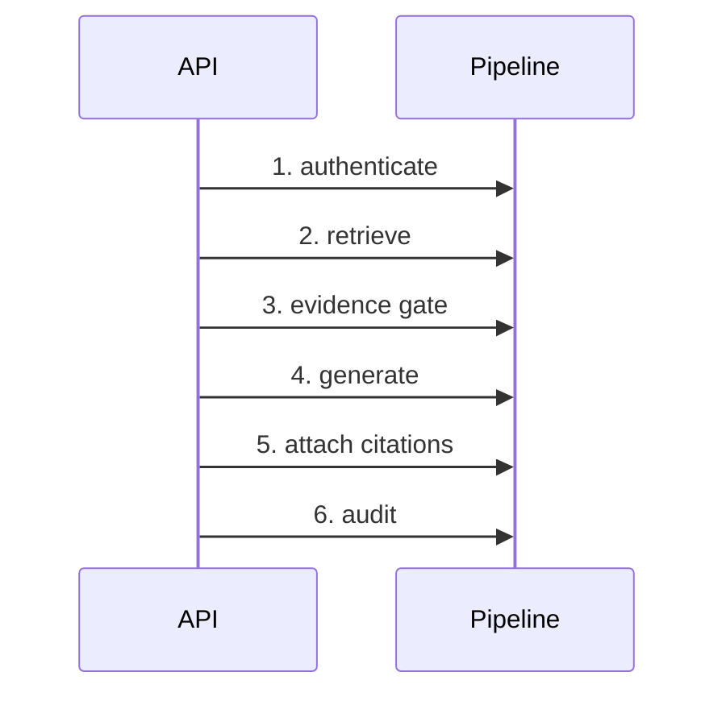
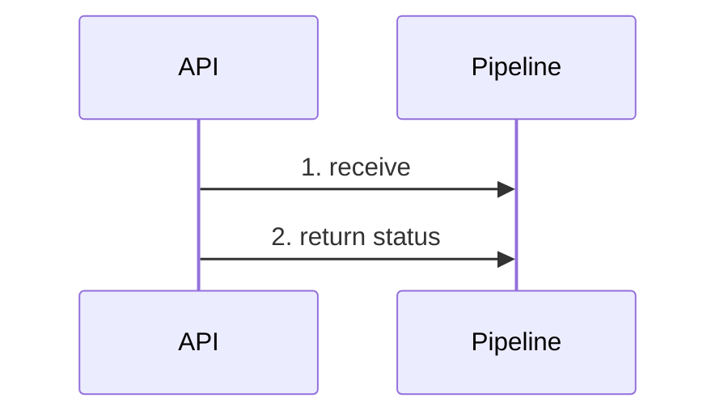

<!-- Generated by uv run app-docs. Do not edit. -->

# API sequences

## `ingestDocument`

```mermaid
sequenceDiagram
    API->>Pipeline: 1. authenticate
    API->>Pipeline: 2. authorize admin
    API->>Pipeline: 3. normalize
    API->>Pipeline: 4. chunk
    API->>Pipeline: 5. embed
    API->>Pipeline: 6. store
    API->>Pipeline: 7. audit
```

## `searchEvidence`

```mermaid
sequenceDiagram
    API->>Pipeline: 1. authenticate
    API->>Pipeline: 2. normalize query
    API->>Pipeline: 3. ACL filter
    API->>Pipeline: 4. retrieve
    API->>Pipeline: 5. fuse
    API->>Pipeline: 6. deduplicate
    API->>Pipeline: 7. audit
```

## `generateGroundedAnswer`

```mermaid
sequenceDiagram
    API->>Pipeline: 1. authenticate
    API->>Pipeline: 2. retrieve
    API->>Pipeline: 3. evidence gate
    API->>Pipeline: 4. generate
    API->>Pipeline: 5. attach citations
    API->>Pipeline: 6. audit
```

## `health`

```mermaid
sequenceDiagram
    API->>Pipeline: 1. receive
    API->>Pipeline: 2. return status
```
